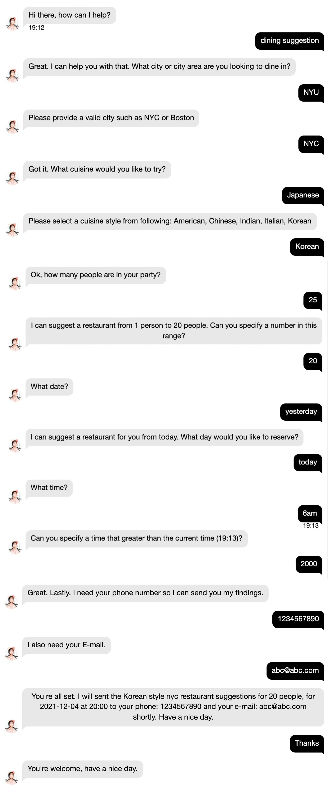
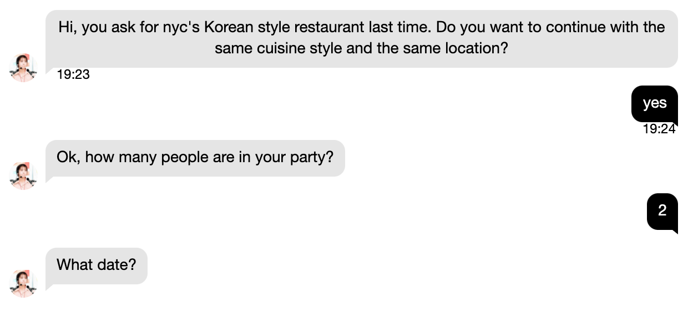
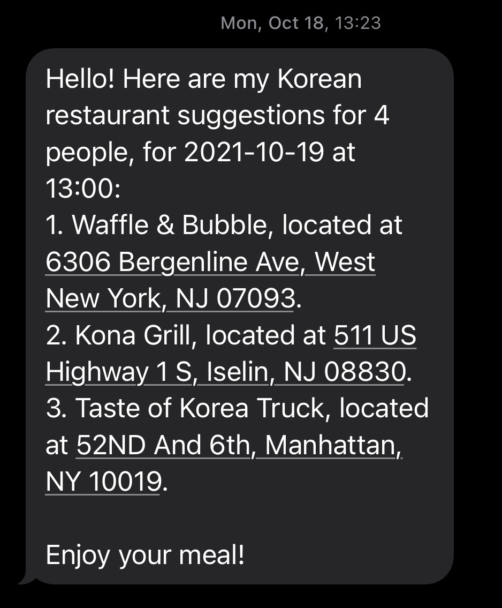
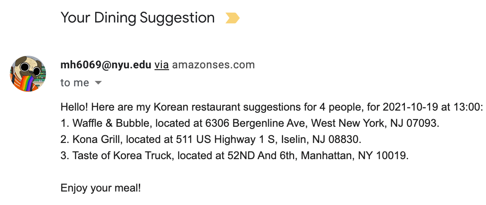
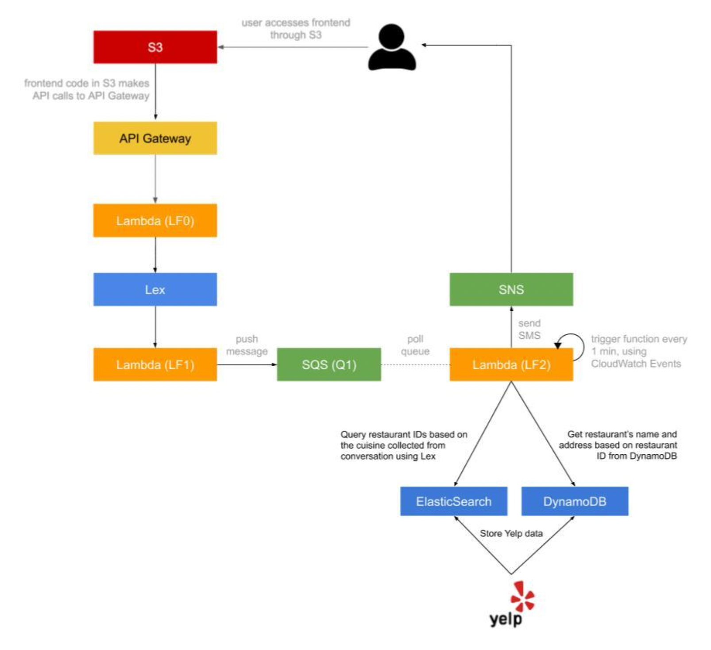

# Dining-Concierge-Chatbot

# Demo

Dining concierge chatbot live demo [here](https://youtu.be/7EnJeuZdgwk)!

# Description

Customer Service is a core service for a lot of businesses around the world and it is getting disrupted at the moment by Natural Language Processing-powered applications.

In this task I implemented a serverless, microservice-driven web application. Specifically, I built a Dining Concierge chatbot that sends you restaurant suggestions given a set of preferences that you provide the chatbot with through conversation.

# Usage
> First time user

> Returned user

> SNS

> E-mail

# Architecture

